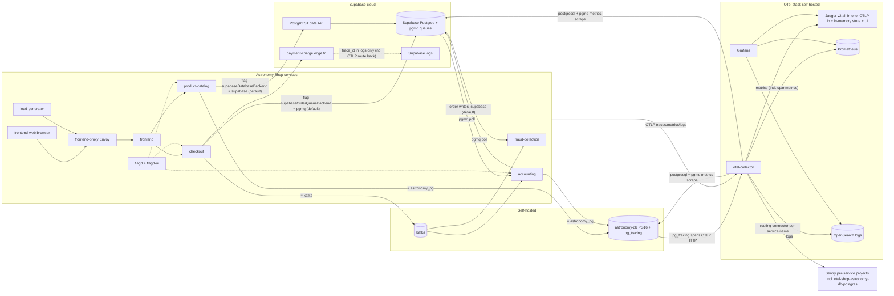

# Deployed architecture — current state

Everything running on the Hetzner deployment (`supa-otel-shop`, all compose
layers: full + observability + pg-tracing + Supabase via `.env.local`). Two flagd
flags move data paths at runtime; everything else is static.

## What the trace backend actually is

There is no separate trace database. **Jaeger v2 all-in-one is the trace
backend**: the collector forwards OTLP to it, it stores traces in an in-memory
store (`MEMORY_MAX_TRACES=25000` — ephemeral, lost on container restart), and
serves its own query UI. Grafana's trace views read from Jaeger. Long-lived
signals are elsewhere: metrics in Prometheus (including span-derived RED metrics
via the collector's spanmetrics connector), logs in OpenSearch, and the Sentry
copy of the traces in Sentry's cloud.

## The two runtime flags

| Flag | Default | Moves |
|---|---|---|
| `supabaseOrderQueueBackend` | `pgmq` | checkout's order hand-off: Supabase Queues vs Kafka (consumers run both; see supa-pgmq-kafka.md) |
| `supabaseDatabaseBackend` | `supabase` | product-catalog reads + accounting order writes: Supabase Postgres vs the pg_tracing-enabled astronomy-db (see supa-db-backend.md) |

## Postgres tracing path

astronomy-db (PG 16, `compose.pg-tracing.yaml`) emits server-side spans —
statement, Planner, ExecutorRun, plan nodes, commit — via pg_tracing's native
OTLP HTTP exporter straight to the collector, stitched to app traces by the
SQLCommenter `traceparent` both direct-SQL services send. From the collector they
fan out like any other spans: Jaeger, spanmetrics→Prometheus, and Sentry (routed
to the dedicated postgres project). Supabase's Postgres cannot emit these spans
today — that contrast is the point of the dogfood
(supa-tracing-initiative project 4).
